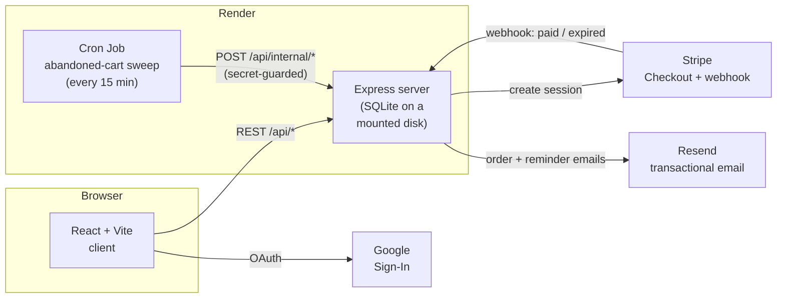

# Park Ave Jewelers

The storefront running at [parkavejewelry.com](https://parkavejewelry.com) — a real jewelry
store's online shop. React + Vite on the front end, Express + SQLite on the back end, Stripe
for payments, Resend for email, Google Sign-In for accounts.

- [Architecture](#architecture)
- [Local development](#local-development)
- [Environment variables](#environment-variables)
- [Payments](#payments)
- [Customer accounts](#customer-accounts)
- [Orders](#orders)
- [Abandoned-cart emails](#abandoned-cart-emails)
- [Admin dashboard](#admin-dashboard)
- [Deploying on Render](#deploying-on-render)
- [Security](#security)

## Architecture



The cron job talks to the server over HTTP instead of opening the SQLite file directly because a
Render disk can only attach to one service — see [Deploying on Render](#deploying-on-render).

## Local development

```bash
# server
cd server && cp .env.example .env   # fill in values, see below
npm install
npm run dev                          # http://localhost:5001

# client (separate terminal)
cd client && cp .env.example .env   # fill in VITE_GOOGLE_CLIENT_ID
npm install
npm run dev                          # http://localhost:5173, proxies /api to :5001
```

First boot seeds 16 sample products and one admin account. If `ADMIN_PASSWORD` isn't set, a
random password is generated and printed once to the server console — grab it then, it's never
shown again or stored anywhere else.

## Environment variables

| Variable | Where to get it | What it's for |
|---|---|---|
| `JWT_SECRET` | `node -e "console.log(require('crypto').randomBytes(48).toString('hex'))"` | Signs admin/customer login tokens |
| `ADMIN_EMAIL` / `ADMIN_PASSWORD` | Pick your own | Admin dashboard login |
| `STRIPE_SECRET_KEY` | Stripe dashboard → Developers → API keys | Stripe Checkout |
| `STRIPE_WEBHOOK_SECRET` | See [Payments](#payments) below | Confirms payment, releases stock on expiry |
| `RESEND_API_KEY` | [resend.com](https://resend.com) → API Keys | Transactional email |
| `EMAIL_FROM` | An address on a domain verified in Resend | "From" address on every email |
| `GOOGLE_CLIENT_ID` (server) + `VITE_GOOGLE_CLIENT_ID` (client, same value) | [Google Cloud Console](https://console.cloud.google.com/apis/credentials) → OAuth client ID → Web application | "Sign in with Google" |
| `CLIENT_URL` | Your production domain | CORS + Stripe redirect URLs |

Missing `STRIPE_SECRET_KEY` gives customers a clean "payments not configured" error instead of a
crash. Missing `GOOGLE_CLIENT_ID` just renders the Google button disabled. Nothing hard-fails on a
missing key except the things that genuinely can't work without it.

## Payments

Checkout redirects to Stripe's hosted Checkout page — card numbers never touch this server, and
prices are always looked up server-side from the `products` table, so a tampered request can't
check out at a discount.

Stock for an item is reserved the moment a Checkout Session is created, not when payment
completes — otherwise two people could both "successfully" buy the last ring at the same time.
The reservation is released again if the session expires unpaid, if an admin cancels the order,
or if an admin refunds it.

Setting up the webhook:

1. Stripe Dashboard → Developers → Webhooks → **Add endpoint**
2. URL: `https://yourdomain.com/api/checkout/webhook`
3. Subscribe to both `checkout.session.completed` and `checkout.session.expired` — the second one
   is what releases reserved stock when someone abandons checkout, and it's easy to forget since
   it isn't selected by default.
4. Copy the signing secret (`whsec_...`) into `STRIPE_WEBHOOK_SECRET`.

Admins can also mark an order `paid` / `unpaid` / `refunded` by hand under **Orders → Payment**,
for phone or wire orders that never touch Stripe.

## Customer accounts

Customers can register with email/password or Google Sign-In, and from their account page:

- Reset a forgotten password (emailed link, one-hour expiry)
- Delete their account (requires typing their password or "DELETE" to confirm)

Resetting a password bumps a `token_version` counter on the customer row, so any JWT issued
before the reset stops working immediately — a leaked token doesn't stay valid just because it
hasn't expired yet.

## Orders

Every checkout attempt writes an order row before redirecting to Stripe, whether or not the
customer finishes paying — that's what makes the abandoned-cart emails below possible.

When an admin changes an order's status to **shipped**, they either have to provide a tracking
number or explicitly confirm one isn't available — there's no way to mark something shipped and
leave the customer with nothing to go on. Every status change (confirmed, shipped, delivered,
etc.) emails the customer automatically.

Cart quantities are capped to live stock everywhere a quantity can be changed — product page,
cart drawer, full cart — so a customer can't add more of something than actually exists. Checkout
enforces the real limit atomically regardless of what the cart shows, since stock can change
between adding an item and paying for it.

## Abandoned-cart emails

A background job (`server/jobs/abandonedCart.js`) checks for orders still `unpaid` an hour after
checkout started (`ABANDONED_CART_DELAY_MINUTES` in `.env`) and emails a reminder via Resend, with
a link back to the still-open Stripe session if there is one. Each order is only ever emailed
once, and anything older than 7 days is skipped, so an outage can't cause a flood of stale
reminders once the job comes back.

In production this runs as its own Render Cron Job hitting an internal, secret-guarded endpoint
(`POST /api/internal/abandoned-cart-check`) rather than an in-process timer — a `setInterval`
wouldn't survive the host sleeping, a deploy restarting it, or ever running as more than one
instance.

Until `EMAIL_FROM` is on a domain verified in Resend (Domains → Add Domain, then add the DNS
records at your registrar), email falls back to Resend's shared sandbox address, which only
delivers to the address your Resend account is registered with.

## Admin dashboard

`/admin` — login, then:

- **Products** — add/edit/delete inventory, upload images
- **Orders & Payments** — status and payment state, per order, with tracking numbers
- **Customer Accounts** — everyone registered or signed in with Google, with order totals
- **Client Messages** — contact form submissions, with a one-click mailto reply

## Deploying on Render

Render's disk is ephemeral by default, which wipes the SQLite file and any uploaded product
photos on every redeploy. To make it stick:

1. Use a paid instance type — free instances can't attach a disk.
2. Add a Disk in the Render dashboard (1 GB is plenty), mounted at something like `/var/data`.
3. Point the app at it:
   ```
   DB_PATH=/var/data/park_ave.db
   UPLOADS_DIR=/var/data/uploads
   ```
4. Redeploy — the server creates both paths on boot if they don't exist.

A disk can only attach to one Render service, which is why the abandoned-cart cron job (above)
runs as a separate service hitting an HTTP endpoint instead of opening the SQLite file directly.

`render.yaml` in the repo root defines both services as a Blueprint, so a fresh Render setup is
mostly "point it at this repo" rather than clicking through every setting by hand.

## Security

- Admin and customer JWTs are separate roles — a customer token can't hit admin routes, and
  vice versa.
- Rate limiting on login, registration, contact form, and checkout.
- Helmet CSP, upload MIME/extension allow-listing, parameterized SQL everywhere.
- No default credentials are ever hardcoded or shown in the UI — see the console-print behavior
  under Local development.
